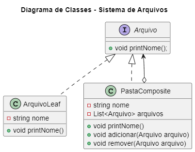

# Design Patterns - Composite

## 💬 Propósito
**O Composite** é um padrão de design estrutural que permite compor objetos em estruturas de árvore e, em seguida, trabalhar com essas estruturas como se fossem objetos individuais.

<figure>

<figcaption> O padrão Composto permite que você execute um comportamento recursivamente sobre todos os componentes de uma árvore de objetos. </figcaption>

</figure>

## 🚗 Analogia com o mundo real
<figure>
      
    <figcaption>Um exemplo de uma estrutura militar.</figcaption>
</figure>

- Os exércitos da maioria dos países são estruturados como hierarquias. Um exército consiste em várias divisões; uma divisão é um conjunto de brigadas, e uma brigada consiste em pelotões, que podem ser divididos em esquadrões. 
  
- Finalmente, um esquadrão é um pequeno grupo de soldados reais. As ordens são dadas no topo da hierarquia e passadas para cada nível até que cada soldado saiba o que precisa ser feito.

## 💡Aplicabilidade

1. <strong> Use o padrão Composto quando precisar implementar uma estrutura de objeto semelhante a uma árvore.</strong>  
O padrão Composite fornece dois tipos básicos de elementos que compartilham uma interface comum: folhas simples e contêineres complexos. Um recipiente pode ser composto de folhas e outros recipientes. Isso permite que você construa uma estrutura de objeto recursivo aninhada semelhante a uma árvore.

2. Use o padrão quando desejar que o código do cliente trate elementos simples e complexos uniformemente.
   
3. Todos os elementos definidos pelo padrão Composite compartilham uma interface comum. Usando essa interface, o cliente não precisa se preocupar com a classe concreta dos objetos com os quais trabalha.

## 🎥 Exemplo
<section align="center">
  </img>
</section>

- <a href="./codigos">Pasta do código</a>

## 📌 Referências
- <a href="https://refactoring.guru/refactoring/catalog">Refactoring Guru</a>
- <a href="https://refactoring.guru/design-patterns/catalog">Design Patterns</a>
<!--- https://refactoring.guru/pt-br/design-patterns/catalog ->
