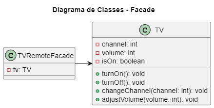

# Design Patterns - Facade

## 💬 Propósito
**O Facade** é um padrão de projeto estrutural que fornece uma interface simplificada para uma biblioteca, um framework, ou qualquer conjunto complexo de classes.

## 🚗 Analogia com o mundo real

  
- Quando você liga para uma loja para fazer um pedido, um operador é sua fachada para todos os serviços e departamentos da loja. O operador fornece a você uma simples interface de voz para o sistema de pedido, pagamentos, e vários sistemas de entrega.

## 💡Aplicabilidade

1. <strong>Utilize o padrão Facade quando você precisa ter uma interface limitada mas simples para um subsistema complexo.</strong>  

2. Com o passar do tempo, subsistemas ficam mais complexos. Até mesmo aplicar padrões de projeto tipicamente leva a criação de mais classes. Um subsistema pode tornar-se mais flexível e mais fácil de se reutilizar em vários contextos, mas a quantidade de códigos padrão e de configuração que ele necessita de um cliente cresce cada vez mais. O Facade tenta consertar esse problema fornecendo um atalho para as funcionalidades mais usadas do subsistema que corresponde aos requerimentos do cliente.

3. <strong>Utilize o Facade quando você quer estruturar um subsistema em camadas.</strong>

4. Crie fachadas para definir pontos de entrada para cada nível de um subsistema. Você pode reduzir o acoplamento entre múltiplos subsistemas fazendo com que eles se comuniquem apenas através de fachadas.

## 🎥 Exemplo
<section align="center">
  </img>
</section>

- <a href="./codigo">Pasta do código</a>

## 📌 Referências
- <a href="https://refactoring.guru/refactoring/catalog">Refactoring Guru</a>
<!--- https://refactoring.guru/pt-br/design-patterns/catalog ->
