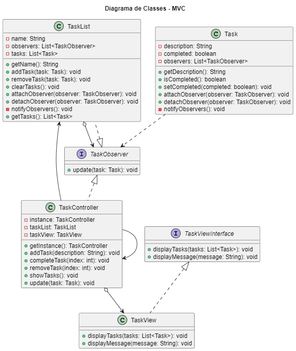

# 📊 Gerenciador de Tarefas (Task Manager)

O Gerenciador de Tarefas é um aplicativo simples desenvolvido em Java que permite adicionar, completar e remover tarefas de uma lista. O projeto utiliza os padrões de projeto **Observer, Composite e Singleton** para estruturar o código de forma modular e flexível.

## 🛠️ Funcionalidades

- Adicionar uma nova tarefa à lista.
- Marcar uma tarefa como concluída.
- Remover uma tarefa da lista.
- Exibir a lista de tarefas.

## 📋 Padrões de Projeto

### 📌 Observer
O padrão Observer é utilizado para estabelecer uma relação de notificação entre as classes `Task` e `TaskList`. Quando uma tarefa é modificada, ela notifica a lista de tarefas e outras entidades interessadas sobre a alteração, permitindo que elas atualizem seu estado de acordo.

### 📌 Composite
O padrão Composite é aplicado na estrutura da classe `TaskList`, permitindo que ela seja composta por várias tarefas individuais. Dessa forma, podemos tratar uma lista de tarefas como uma tarefa única, simplificando a manipulação e o gerenciamento.

### 📌 Singleton
O padrão Singleton é utilizado na classe `TaskController`, garantindo que apenas uma instância dela seja criada em todo o programa. Isso permite que o controlador seja acessado globalmente de qualquer ponto do código, facilitando o gerenciamento das tarefas.

## 🖥️ Como executar o projeto

1. Certifique-se de ter o Java Development Kit (JDK) instalado em sua máquina.
2. Baixe ou clone o repositório do projeto.
3. Navegue até o diretório do projeto no terminal.
4. Compile os arquivos Java com o seguinte comando: `javac *.java`.
5. Execute o programa com o seguinte comando: `java Main`.

## 📈 Diagrama

<section align="center">
  </img>
</section>