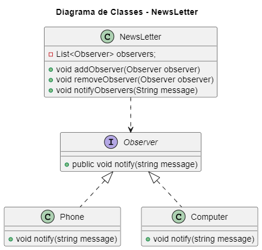

# Design Patterns - Observer

## 💬 Propósito
**O Observer** é um padrão de design comportamental que permite definir um mecanismo de assinatura para notificar vários objetos sobre quaisquer eventos que aconteçam com o objeto que eles estão observando.

## 🚗 Analogia com o mundo real

Se você assinar um jornal ou revista, não precisará mais ir à loja para verificar se a próxima edição está disponível. Em vez disso, o editor envia novos problemas diretamente para sua caixa de correio logo após a publicação ou mesmo com antecedência.

O editor mantém uma lista de assinantes e sabe em quais revistas eles estão interessados. Os assinantes podem deixar a lista a qualquer momento quando desejarem impedir que o editor envie novas edições de revistas para eles.

## 💡Aplicabilidade

1. <strong>Use o padrão Observador quando as alterações no estado de um objeto puderem exigir a alteração de outros objetos e o conjunto real de objetos for desconhecido de antemão ou for alterado dinamicamente.</strong>

 Muitas vezes, você pode enfrentar esse problema ao trabalhar com classes da interface gráfica do usuário. Por exemplo, você criou classes de botão personalizadas e deseja permitir que os clientes conectem algum código personalizado aos botões para que ele seja acionado sempre que um usuário pressionar um botão.

2. O padrão Observador permite que qualquer objeto que implemente a interface do assinante assine notificações de eventos em objetos do editor. Você pode adicionar o mecanismo de assinatura aos seus botões, permitindo que os clientes conectem seu código personalizado por meio de classes de assinante personalizadas.

3. Use o padrão quando alguns objetos em seu aplicativo devem observar outros, mas apenas por um tempo limitado ou em casos específicos.

4. A lista de assinaturas é dinâmica, para que os assinantes possam entrar ou sair da lista sempre que precisarem.

## 🎥 Exemplo
<section align="center">
  </img>
</section>

- <a href="./codigo">Pasta do código</a>

## 📌 Referências
- <a href="https://refactoring.guru/refactoring/catalog">Refactoring Guru</a>
<!--- https://refactoring.guru/pt-br/design-patterns/catalog ->
