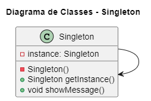

# Design Patterns - Singleton

## 💬 Propósito
O Singleton é um padrão de projeto criacional que permite a você garantir que uma classe tenha apenas uma instância, enquanto provê um ponto de acesso global para essa instância.

## 🚗 Analogia com o mundo real

O governo é um excelente exemplo de um padrão Singleton. Um país pode ter apenas um governo oficial. Independentemente das identidades pessoais dos indivíduos que formam governos, o título, “O Governo de X”, é um ponto de acesso global que identifica o grupo de pessoas no command.

## 💡Aplicabilidade

1. Utilize o padrão Singleton quando uma classe em seu programa deve ter apenas uma instância disponível para todos seus clientes; por exemplo, um objeto de base de dados único compartilhado por diferentes partes do programa.

2. O padrão Singleton desabilita todos os outros meios de criar objetos de uma classe exceto pelo método especial de criação. Esse método tanto cria um novo objeto ou retorna um objeto existente se ele já tenha sido criado.

3. <strong>Utilize o padrão Singleton quando você precisa de um controle mais estrito sobre as variáveis globais.</strong>

## 🎥 Exemplo
<section align="center">
  </img>
</section>

- <a href="./codigo">Pasta do código</a>

## 📌 Referências
- <a href="https://refactoring.guru/refactoring/catalog">Refactoring Guru</a>
<!--- https://refactoring.guru/pt-br/design-patterns/catalog -> strategy -->
