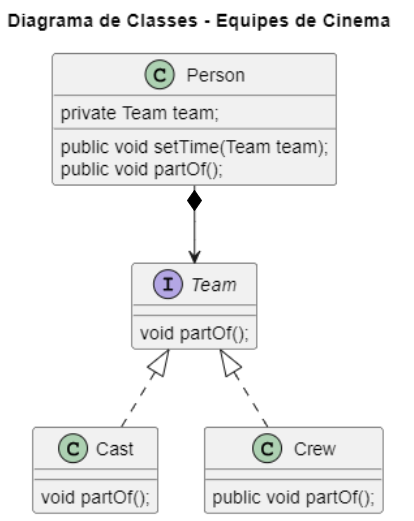

# Design Patterns - Strategy

## 💬 Propósito
O Strategy é um padrão de projeto comportamental que permite que você defina uma família de algoritmos, coloque-os em classes separadas, e faça os objetos deles intercambiáveis.

## 🚗 Analogia com o mundo real

Imagine que você tem que chegar ao aeroporto. Você pode pegar um ônibus, pedir um táxi, ou subir em sua bicicleta. Essas são suas estratégias de transporte. Você pode escolher uma das estratégias dependendo de fatores como orçamento ou restrições de tempo.

## 💡Aplicabilidade

1. Utilize o padrão Strategy quando você quer usar diferentes variantes de um algoritmo dentro de um objeto e ser capaz de trocar de um algoritmo para outro durante a execução.

2. O padrão Strategy permite que você altere indiretamente o comportamento de um objeto durante a execução ao associá-lo com diferentes sub-objetos que pode fazer sub-tarefas específicas em diferentes formas.

3. <strong>Utilize o Strategy quando você tem muitas classes parecidas que somente diferem na forma que elas executam algum comportamento.</strong>

4. <strong>O padrão Strategy permite que você extraia o comportamento variante para uma hierarquia de classe separada e combine as classes originais em uma, portando reduzindo código duplicado.</strong>

5. O padrão Strategy permite que você isole o código, dados internos, e dependências de vários algoritmos do restante do código. Vários clientes podem obter uma simples interface para executar os algoritmos e trocá-los durante a execução do programa.

6. Utilize o padrão quando sua classe tem um operador condicional muito grande que troca entre diferentes variantes do mesmo algoritmo.

7. O padrão Strategy permite que você se livre dessa condicional ao extrair todos os algoritmos para classes separadas, todos eles implementando a mesma interface. O objeto original delega a execução de um desses objetos, ao invés de implementar todas as variantes do algoritmo.

## 🎥 Exemplo
</img>
- Arquivo <a href="Cinema.zip">ZIP</a> do código

## 📌 Referências
- <a href="https://refactoring.guru/refactoring/catalog">Refactoring Guru</a>
<!--- https://refactoring.guru/pt-br/design-patterns/catalog -> strategy -->
