# Interação Humano Computador 
**Objetivo:** Aplicar os conceitos de usabilidade de software. Neste <a href="https://www.w3.org/WAI/WCAG21/quickref/?showtechniques=129&currentsidebar=%23col_overview#principle1">documento</a>, a W3C cobre todas as estratégias que devem ser seguidas para tornar o conteúdo da web mais acessível.

## WCAG - Web Content Acessibility Guidelines
A partir do foco em acessibilidade, o WCAG procura atingir um grupo extenso de pessoas com as mais variadas demandas. Por isso, trata-se de um documento amplo e que considera um número extenso de medidas adotáveis para qualificar a acessibilidade de determinado portal.

Em um dos seus pontos, por exemplo, o registro define os recursos que devem ser aplicados na inclusão de usuários cegos na política de acessibilidade do seu website, delimitando a utilização de descrições ALT como imprescindível para o sucesso. Mas o documento também considera daltônicos, pessoas com deficiência auditiva e de fala etc.

O WCAG ocupa posição de destaque entre os recursos mais valiosos que uma empresa pode ter em mãos durante o processo de construção de um endereço na internet. Especialmente se o objetivo principal está voltado à criação de uma página abrangendo todos os públicos com o máximo de sucesso.

## 1. Percepcionável
As informações e os componentes da interface do usuário devem ser apresentáveis aos usuários de maneiras que possam perceber.

### 1.1 Alternativas de texto
Conforme a sequência da própria WCAG, este é o critério de sucesso "1.1.1 - Conteúdo não textual" que trata justamente de como podemos aplicar alternativas em texto para conteúdos que não são apresentados originalmente como textos.

Por que o critério existe?
Descrever QUALQUER conteúdo visual é altamente importante para que todos possam entender o que está sendo apresentado, principalmente levando em consideração que recursos visuais são amplamente utilizados por designers para compor layouts e telas.

Um bom exemplo disso são as descrições de imagem do twitter:

<section align="center">
    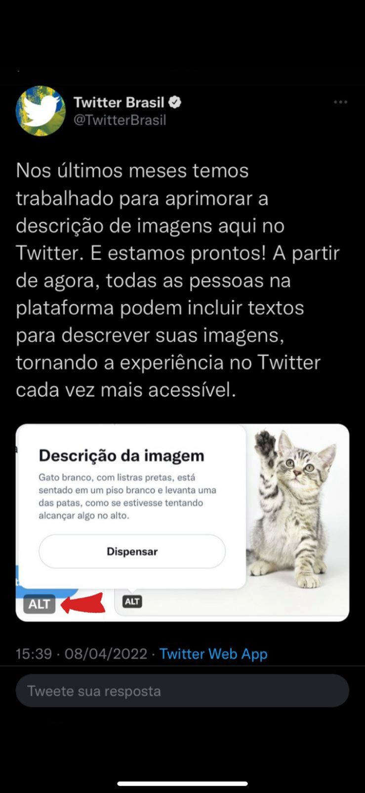
    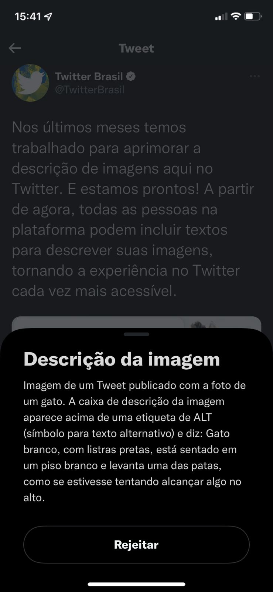
</section> 

> Link do <a href="https://twitter.com/TwitterBrasil/status/1512500459600326670">tweet</a>

### 1.2 Mídia baseada no tempo
Forneça alternativas para mídia baseada no tempo.

Qualquer conteúdo pré-gravado que contenha uma faixa de áudio (seja apenas áudio ou vídeo) deve possuir legenda.

Um bom exemplo disso é o Spotify que coloca as letras das músicas enquanto as mesmas tocam:

<video src="./images/musica.mp4"></video>

> <iframe style="border-radius:12px" src="https://open.spotify.com/embed/track/5EGPf0nqO7vEIwsOX6Er98?utm_source=generator&theme=0" width="100%" height="152" frameBorder="0" allowfullscreen="" allow="autoplay; clipboard-write; encrypted-media; fullscreen; picture-in-picture" loading="lazy"></iframe>

### 1.3 Adaptável
Crie conteúdo que possa ser apresentado de diferentes maneiras (por exemplo, layout mais simples) sem perder informações ou estrutura.
Um recurso da adaptabilidade é a Orientação.
Alguns sites e aplicativos exigem que os usuários orientem seus dispositivos móveis em modo paisagem ou retrato, em vez de dar-lhes uma escolha. A intenção desse critério de sucesso é garantir que os usuários que não podem rodar facilmente seu dispositivo ainda possam acessar conteúdo e funcionalidade em sites em qualquer orientação do dispositivo.

Um bom exemplo disso é a Apple que fez o site ser responsivo, isto é, faz com que sua página da web fique bem em todos os dispositivos e ainda se adeque no modo retrato e paisagem.

<section align="center">
    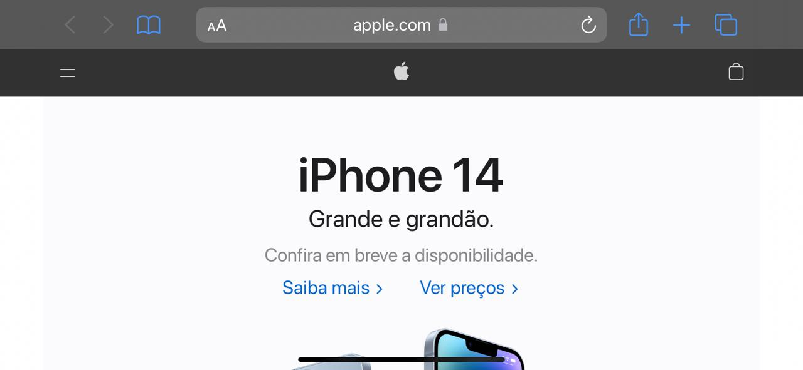
    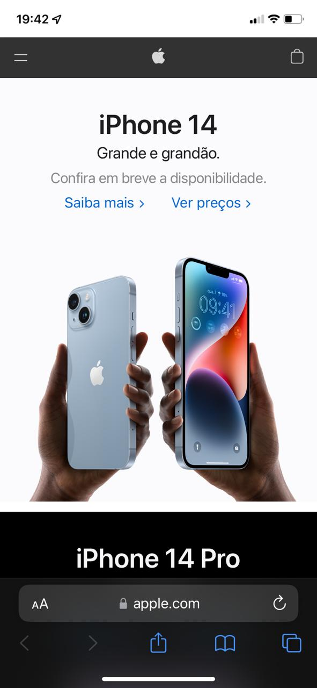
</section> 

### 1.4 Distinguível
A intenção deste Critério de Sucesso é garantir que todos os usuários com visão possam acessar informações que são transmitidas por diferenças de cor, ou seja, pelo uso de cor onde cada cor tem um significado atribuído a ela. Se as informações forem transmitidas por diferenças de cor em uma imagem (ou outro formato não-texto), a cor pode não ser vista por usuários com deficiências de cor. Neste caso, fornecer as informações transmitidas com cor através de outro meio visual garante que os usuários que não podem ver a cor ainda possam perceber as informações.

A cor é um importante ativo no design de conteúdo web, aumentando seu apelo estético, sua usabilidade e sua acessibilidade. No entanto, alguns usuários têm dificuldade em perceber a cor. Pessoas com visão parcial muitas vezes experimentam visão de cores limitada, e muitos usuários mais velhos não vêem bem a cor. Além disso, as pessoas que usam displays de cores limitadas ou monocromáticas e navegadores não poderão acessar informações que são apresentadas apenas em cores.

Um bom exemplo desse recurso é quando esquecemos de preencher algum campo obrigatório de um formulário:

<section align="center">
    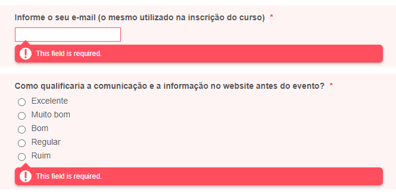
</section>

## 2. Operável
Os componentes da interface do usuário e a navegação devem ser operáveis.

### 2.1 Teclado acessível
Usuários que interagem com seus dispositivos através da fala muitas vezes usam palavras ou strings de letras para fazê-lo. Aplicativos e sites que usam comandos de teclado de letras únicas para ativar funções podem ser frustrantes ou não funcionais para esses usuários, porque ditar uma palavra pode ter consequências totalmente não intencionais. Dar aos usuários a capacidade de desligar, remapear ou limitar a ativação desses atalhos retorna funcionalidade a esses usuários.

Um bom exemplo desse recurso é o uso dos atalhos de teclado: 

<section align="center">
    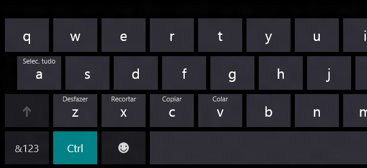
</section>

### 2.2 Tempo suficiente
Forneça aos usuários tempo suficiente para ler e usar conteúdo.
Qualquer elemento na tela que tenha movimento automático ou pisque e que dure mais do que 5 segundos, deve ter um tipo de controle onde a pessoa que o utiliza pode pausar, parar ou ocultar. 

Um bom exemplo desse recurso é o botão de pause que o Youtube oferece: 

<section align="center">
    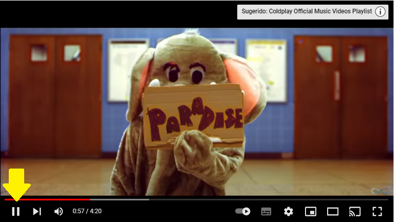
</section>

> Link do <a href="https://www.youtube.com/watch?v=1G4isv_Fylg&ab_channel=Coldplay">vídeo</a>

### 2.3 Convulções e Reações Físicas
Não projete conteúdo de forma conhecida por causar convulsões ou reações físicas.
Nenhum conteúdo da página deve piscar mais que 3 vezes por segundo, a não ser que os flashes estejam em baixo contraste ou possuam pouco vermelho.

### 2.4 Navegável
Fornecer maneiras de ajudar os usuários a navegar, encontrar conteúdo e determinar onde eles estão.
Um mecanismo está disponível para contornar blocos de conteúdo que são repetidos em várias páginas da Web. 

Um bom exemplo disso é o menu da amazon, que está presente em todas as páginas que o usuário possa acessar do site.

<section align="center">
    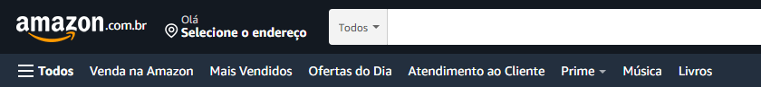
</section>

>Link do <a href="https://www.amazon.com.br/">site</a> utilizado.

### 2.5 Modalidades de entrada
Facilite a funcionalidade dos usuários através de várias entradas além do teclado.

Toda funcionalidade que exige um caminho tátil para ser acionada (exemplo: arrastar com o dedo em uma tela de toque) precisa também de um método alternativo que facilite a interação por quem não consegue efetuar o gesto.

Um bom exemplo disso é quando fazemos o movimento de "pinça" no touchpad de algum notebook, o resultado esperado na maioria dos dispositivos é que dê um zoom.

<section align="center">
    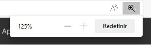
    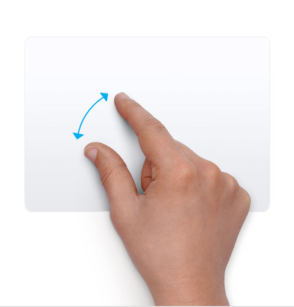
</section>

## 3 - Compreensível
As informações e o funcionamento da interface do usuário devem ser compreensíveis.
### 3.1 Legível
Palavras regionais específicas e nomes próprios costumam ter pronúncias também específicas. Deve ser fornecida uma forma de possibilitar a correta compreensão da pronúncia em alguns casos.

Um bom exemplo disso é o wikipédia, que disponibiliza um arquivo de áudio exemplificando como deve ser a pronúncia: 

<section align="center">
    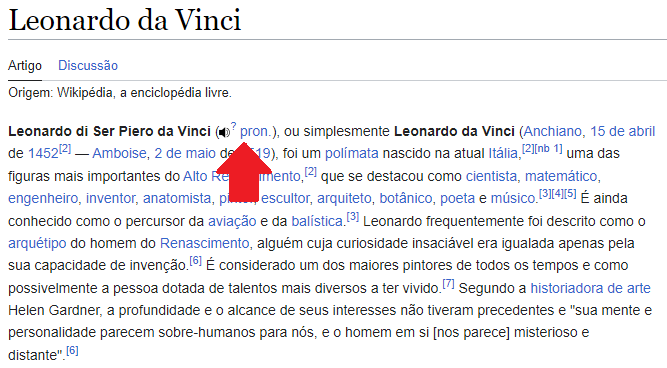
</section>

>Link do <a href="https://pt.wikipedia.org/wiki/Leonardo_da_Vinci">artigo wikipedia</a>

### 3.2 Previsível
A  intenção deste Critério de Sucesso é garantir uma identificação consistente de componentes funcionais que aparecem repetidamente dentro de um conjunto de páginas da Web. Uma estratégia que as pessoas que usam leitores de tela usam ao operar um site da Web é confiar fortemente em sua familiaridade com funções que podem aparecer em diferentes páginas da Web. Se funções idênticas tiverem rótulos diferentes (ou, mais geralmente, um nome acessível diferente) em diferentes páginas da Web, o site será consideravelmente mais difícil de usar. Também pode ser confuso e aumentar a carga cognitiva para pessoas com limitações cognitivas. Portanto, rotulagem consistente ajudará.

Essa consistência se estende às alternativas de texto. Se ícones ou outros itens não-texto tiverem a mesma funcionalidade, então suas alternativas de texto também devem ser consistentes.

Um bom exemplo disso é o ícone de carrinho de compras que normalmente em todos os e-commerces: 

<section align="center">
    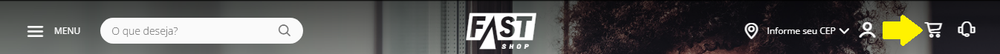
    
    
</section>

>Link dos sites utilizados: <a href="https://www.fastshop.com.br/web/">Fast Shop</a>, <a href="https://www.kabum.com.br/">Kabum</a>, <a href="https://www.amazon.com.br/">Amazon</a>.

### 3.3 Assistência de entrada
A intenção deste Critério de Sucesso é que os autores de conteúdo apresentem instruções ou rótulos que identifiquem os controles de forma que os usuários saibam quais dados de entrada são esperados. No caso de botões de rádio, caixas de seleção, comboboxes ou controles similares que fornecem aos usuários opções, cada opção deve ter um rótulo apropriado para que os usuários saibam o que estão realmente selecionando. As instruções ou rótulos também podem especificar formatos de dados para campos de entrada de dados, especialmente se eles estão fora dos formatos habituais ou se há regras específicas para a entrada correta. Os autores de conteúdo também podem optar por disponibilizar tais instruções aos usuários somente quando o controle individual tiver foco especialmente quando as instruções forem longas e verbosas.

A intenção deste Critério de Sucesso não é confundir a página com informações desnecessárias, mas fornecer dicas e instruções importantes que beneficiem as pessoas com deficiência. Muita informação ou instrução pode ser tão prejudicial quanto muito pouco. O objetivo é garantir que informações suficientes sejam fornecidas para que o usuário realize a tarefa sem confusão indevida ou navegação.

Um bom exemplo disso é quando o usuário realiza o cadastro no site das Americanas, eles informam-o como os campos devem ser preenchidos, para prevenção de erros: 

<section align="center">
    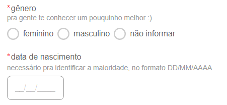
</section>

>Link do cadastro das <a href="https://cliente.americanas.com.br/minha-conta/cadastro?next=https://www.americanas.com.br/">Americanas</a>.
## 4 - Robusto
O conteúdo deve ser robusto o suficiente para que possa ser interpretado por uma grande variedade de agentes do usuário, incluindo tecnologias assistivas.
### 4.1 Compatível
No conteúdo implementado usando linguagens de marcação, as mensagens de status podem ser determinadas programáticamente por meio de função ou propriedades, de modo que possam ser apresentadas ao usuário por tecnologias assistivas sem receber foco.

Um bom exemplo desse recurso é o Discord, que possibilita o usuário setar o status dele, ou irá ser setado automáticamente: 

<section align="center">
    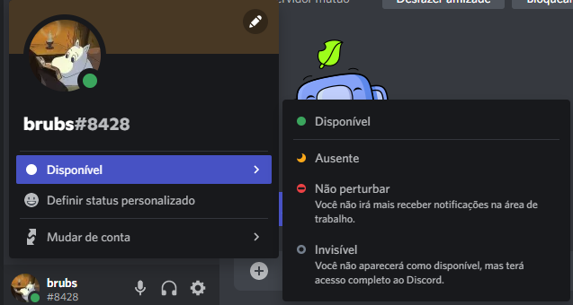
</section>

## Referências
- <a href="https://www.w3.org/WAI/WCAG21/quickref/?showtechniques=129&currentsidebar=%23col_overview#principle1"> Heurísticas </a>
- <a href="https://guia-wcag.com/"> Guia </a>